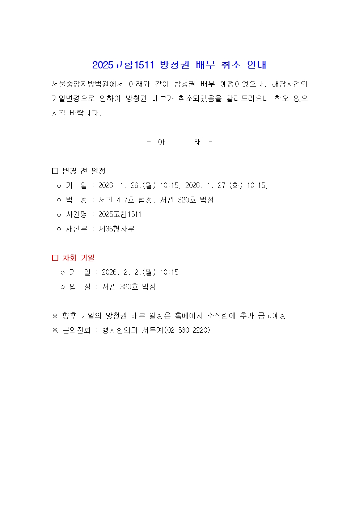

# innocens-ego-sum

### 26. 1. 26 
- 今日と明日の公判は2/2に延期されたそうです:
  - *주요사건(형사) 방청권 배부 취소 안내\[2025고합1511 / 2026. 1. 26.(월) 10:15, 2026. 1. 27.(화) 10:15\]* 
  - https://seoul.scourt.go.kr/dcboard/new/DcNewsViewAction.work?seqnum=19458&gubun=41
  - 

- https://youtube.com/shorts/Rs0_pbAF7OQ
- https://youtu.be/KtqCgCQAGFs
- https://github.com/anissatta/innocens-ego-sum/blob/main/jan26/p1.m4a

- 
- 
- 
- 
- 
- 
- 
- 

### 26. 1. 25 
- :rice: https://youtu.be/g1SIs7LQ2fY

### 26. 1. 24 
- :rice: https://youtu.be/htHII5_fSRU

### 26. 1. 23 
- https://youtu.be/0anz6SU5lEs
- https://youtu.be/9sXRK6vw3Eg
- https://youtu.be/23yuFWf2sd4

- https://github.com/anissatta/innocens-ego-sum/blob/main/jan23/hw1.m4a
- https://github.com/anissatta/innocens-ego-sum/blob/main/jan23/hw2.m4a

- 
- 
- 
- 
- 
- 
- 
- 
- 
- 
- 
- 
- 
- 
- 
- 
- 
- 
- 
- 
- 
- 
- 
- 
- 
- 
- 
- 
- 
- 
- 

- 記帳の様子です: 
  - https://kangdaegae.web.fc2.com/misc/ipoint/2026/jan23-b1.mp4
  - https://kangdaegae.web.fc2.com/misc/ipoint/2026/jan23-b2.mp4
  - https://kangdaegae.web.fc2.com/misc/ipoint/2026/jan23-b3.mp4
- YouTube: 
  - https://youtu.be/lVpQkgODcPU
  - https://youtu.be/jZFZVrGoskM
  - https://youtu.be/acxI3mQh8v4
- 7 AM: 梅田のグランドビル内の支店が午前7時に開店するのでそこで記帳しました。動画は部屋に戻ってからアップロードします。 
  - https://mycatiskorean.blogspot.com/2026/01/pps_0662854799.html?m=1
  - これが噂の原因だとは思えませんが、私の預金残高の減り方が緩やかになっているのは退職後スーパーマーケットのプリペイドカードに一切チャージを行っていないので当然なのです。私の預金残高は各種プリペイドカードの残高との合計で考えてみて下さい。
  - あとURの家賃引き落としは毎月25日にありますが、今月は25日およびその前日が土日ですので給与は家賃引き落とし前に支払われるのです。家賃の場合は逆に銀行の非営業日の後に処理が行われる筈です。
  - これは以前も書きましたが、私が働いていた会社は締日が10日ですので今日支払われる賃金は前回の締日である25/12/10の翌日である25/12/11から26/1/10の期間における労働日数に基づいて計算されているはずです。 

- 
- 
- 
- 
- 
- 
- 
- 
- 
- 
- 

- 給料日当日の残高です: 
  - https://kangdaegae.web.fc2.com/misc/ipoint/2026/jan23-l1.mp4
  - https://kangdaegae.web.fc2.com/misc/ipoint/2026/jan23-l2.mp4
- YouTube: 
  - https://youtube.com/shorts/qtIUdg-O2eY
  - https://youtube.com/shorts/cUQBQ3oeexA

### 26. 1. 22 
- https://youtu.be/ekR9cy4_KDw
- 
- 
- 
- 
- 
- 
- 
- 
- 
- 
- 
- 
- 
- 
- 
- 
- 

### 26. 1. 21 
- *\[Breaking\] Ex-PM gets 23 years in prison as court calls 2024 martial law an insurrection* 
  - https://www.koreaherald.com/article/10660034
- *Court Sentences Former PM Han Duck-soo to 23 Years for Insurrection* 
  - https://www.chosun.com/english/national-en/2026/01/21/7DOCJECPPNGRXLP3O5NVKJZT24/
- *South Korea court sentences ex-PM Han to 23-year jail term in case related to martial law* 
  - https://www.reuters.com/world/asia-pacific/south-korea-court-finds-ex-pm-han-duck-soo-guilty-key-action-insurrection-over-2026-01-21/

### 26. 1. 20 
- https://youtu.be/QfJYrSs-z0o

### 26. 1. 19 
- https://youtube.com/shorts/HHiCwyXqjbM
- https://youtube.com/shorts/qW8M_z9eUDU

- 
- 
- 
- 
- 

- 
- 
- 
- 

- https://youtu.be/IRaCqdNsU9o
- 
- 
- 
- 
- 
- 
- 

- 手紙にも書いたように今日からトップワールドでのみ買い物をし、早くトップワールドプリペイドカードを使い切ってしまうつもりです。恐らく私がコノミヤとトップワールドを交互に利用していたことが原因で何らかの噂が流されていた可能性もあるかと思います。あと明日は時間があるのでトップワールドの他の店舗にも行って調査してみようかとも考えています。
- 私が利用しているトップワールド富田店は3食入の辛ラーメンやチャミスルといった韓国製品のいくつかを扱っていません。(期間限定でこういったものが並ぶ時もありますが) キムチについてもコノミヤと比べると圧倒的に種類が少なく、ラベルを見ていると若干の悪意すら感じます。皆様もご自身で確かめてみて下さい。 

### 26. 1. 18 
- 今月は25日 および その前日である24日がいずれも銀行の非営業日ですので23日に給与が支給されるようです。私が働いていた神戸市場通運は10日締めの当月25日払いだったと記憶していますが、私は昨年12月29日以降労働していませんので、昨年12月11日(木)〜12月29日(月)の期間における13日(*8hrs)の労働についての賃金がこの日に支払われるのだと思います。 

- In case you missed it: 
  - *Ruling on ex-first lady Kim Keon Hee bribery case set for Jan. 28* 
  - https://koreajoongangdaily.joins.com/news/2025-12-17/national/socialAffairs/Ruling-on-exfirst-lady-Kim-Keon-Hee-bribery-case-set-for-Jan-28/2480327

### 26. 1. 17 
- https://youtube.com/shorts/geNwbw1bZwI
- https://youtube.com/shorts/L5DlQH4a23Q

### 26. 1. 16 
- *South Korea’s Yoon Gets Jail Term in First of Series of Rulings* 
  - https://www.bloomberg.com/news/articles/2026-01-16/south-korea-s-yoon-gets-5-year-term-in-first-martial-law-ruling

- https://youtube.com/shorts/VKFBjndgyxk
- 

### 26. 1. 15 
- https://youtube.com/shorts/B-PRJ1X_GCY
- https://youtu.be/kN5IQ6HhInw
- https://youtube.com/shorts/m3WW7lKtJRU

- https://github.com/anissatta/innocens-ego-sum/blob/main/jan15/kenpo1.m4a
- https://github.com/anissatta/innocens-ego-sum/blob/main/jan15/kenpo2.m4a

- 
- 
- 
- 
- 
- 
- 
- 
- 
- 
- 
- 
- 
- 
- 
- 
- 
- 
- 
- 
- 

---- 
      
- https://youtube.com/shorts/cGruw5CEv90

- 
- 
- 
- 
- 
- 
- 

### 26. 1. 14 
- https://youtu.be/3p6L9bLFrKw

- 

- 
- 
- 
- 
- 
- 
- 
- 
- 
- 
- 
- 
- 
- 
- 
- 

- *Death penalty requested for Yoon Suk Yeol over insurrection charge* 
  - https://www.koreaherald.com/article/10654839

### 26. 1. 9 
- https://youtube.com/shorts/8IHI7x6-pkU
- https://youtube.com/shorts/BVXfXVJI7F0

- 
- 
- 
- 
- 
- 
- 
- 

### 26. 1. 7 
- 
- 
- 
- 
- 
- 
- 
- 

### 26. 1. 5 
- 
- 
- 
- 
- 

- 
- 
- 
- 
- 
